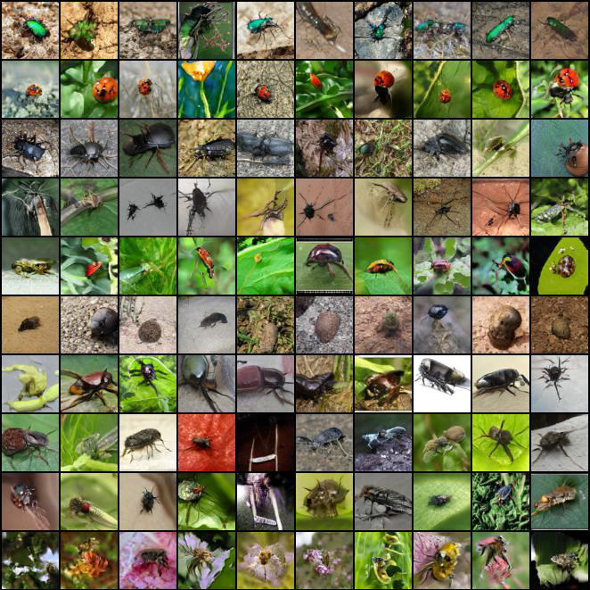

# FQ-GAN

This repository contains source code to reproduce the results presented in the paper ``Feature Quantization Improves GAN Training‘’.

<p align="center">
  
</p>


## Contents

1. [FQ-BigGAN](#FQ-BigGAN)
2. [FQ-U-GAT-IT](#FQ-U-GAT-IT)
3. [FQ-StyleGAN](#FQ-StyleGAN)


##  FQ-BigGAN

This code is based on [PyTorchGAN](https://github.com/ajbrock/BigGAN-PyTorch). Here we will give more details of the code usage. You will need **python 3.x, pytorch 1.x, tqdm ,h5py**

### Prepare datasets
1. CIFAR-10 or CIFAR-100 (change C10 to C100 to prepare CIFAR-100)
```
python make_hdf5.py --dataset C10 --batch_size 256 --data_root data
python calculate_inception_moments.py --dataset C10 --data_root data --batch_size 128
```
2. ImageNet, first you need to manually download ImageNet and put all image class folders into `./data/ImageNet`, then execute the following command to prepare ImageNet (128&times;128)

```
python make_hdf5.py --dataset I128 --batch_size 256 --data_root data
python calculate_inception_moments.py --dataset I128_hdf5 --data_root data --batch_size 128
```

### Training 
We have four bash scripts in  FQ-BigGAN/scripts to train CIFAR-10, CIFAR-100, ImageNet (64&times;64) and ImageNet (128&times;128), respectively. For example, to train CIFAR-100, you may simply run

```
sh scripts/launch_C100.sh
```

To modify the FQ hyper-parameters, we provide the following options in each script as arguments:

1. `--discrete_layer`: it specifies which layers you want quantization to be added, i.e. 0123 
2. `--commitment` : it is the quantization loss coefficient, default=1.0
3. `--dict_size`:  the size of the EMA dictionary, default=8, meaning there are 2^8 keys in the dictionary.
4. `--dict_decay`:  the momentum when learning the dictionary, default=0.8.

### Experiment results
Learning curves on CIFAR-100.
<p align="center">
  
</p>

FID score comparison with BigGAN on ImageNet

<center>
	
| Model     | 64&times;64  | 128&times;128|
|:--------:|:-------:|:-------------:|
| BigGAN    |10.55   |  14.88 | 
| FQ-BigGAN | 9.67   |  13.77  |
	
</center>

<!--

Generated sample comparison on ImageNet (64x64)
| BigGAN | FQ-BigGAN |
:-------------------------:|:-------------------------:|
 | 
 | 

-->

## FQ-U-GAT-IT

This experiment is based on the official codebase [U-GAT-IT](https://github.com/taki0112/UGATIT). Here we plan to give more details of the dataset preparation and code usage. You will need **python 3.6.x, tensorflow-gpu-1.14.0, opencv-python, tensorboardX**

<p align="center">
  
</p>

### Prepare datasets
We use selfie2anime, cat2dog, horse2zebra, photo2portrait, vangogh2photo.

1. selfie2anime: go to  [U-GAT-IT](https://github.com/taki0112/UGATIT) to download the dataset and unzip it to `./dataset`.
2. cat2dog and photo2portrait: here we provide a bash script adapted from [DRIT](https://github.com/HsinYingLee/DRIT) to download the two datasets.
```
cd FQ-U-GAT-IT/dataset && sh download_dataset_1.sh [cat2dog, portrait]
```
3. horse2zebra and vangogh2photo: here we provide a bash script adapted from [CycleGAN](https://github.com/junyanz/CycleGAN) to download the two datasets.
```
cd FQ-U-GAT-IT && bash download_dataset_2.sh [horse2zebra, vangogh2photo]
```

### Training
```
python main.py --quant [type=bool, True/False] --commitment_cost [type=float, default=2.0] --quantization_layer [type=str, i.e. 123] --decay [type=float, default=0.8]
```
By  default, the training procedure will output checkpoints and intermediate translations from (testA, testB) to `checkpoints (checkpoints_quant)` and `results (results_quant)` respectively.

## FQ-StyleGAN

This experiment is based on the official codebase [StyleGAN](https://github.com/NVlabs/stylegan). The original [Flicker-Faces](https://arxiv.org/abs/1812.04948) dataset includes multi-resolution data. This codebase currently supports up to 128&times;128 resolution. We plan to release a complete version to support the full resolution and highligh the results soon.
You will need **python 3.6.x, tensorflow-gpu 1.14.0, numpy**

### Prepare datasets
To obtain the FFHQ dataset, please refer to [FFHQ repository](https://github.com/NVlabs/ffhq-dataset) and download the tfrecords dataset [FFHQ-tfrecords](https://drive.google.com/drive/folders/1LTBpJ0W_WLjqza3zdayligS8Dh1V1gA6) into `datasets/ffhq`.

### Training
```
python run_training.py --num-gpus=8 --data-dir=datasets --config=config-e --dataset=ffhq --mirror-augment=true --total-kimg 25000 --gamma=100 --D_type=1 --discrete_layer {type=string, default=45} --commitment_cost [type=float, default=0.8]

```
Training settings such as the choice of dataset and learning rate can be found in `train.py`. You can tune FQ parameters through the class `D_basic_quant` in `training/networks_stylegan.py`.

## Acknowledgements
We thank official open-source implementations of [BigGAN](https://arxiv.org/abs/1809.11096), [StyleGAN](https://arxiv.org/abs/1809.11096) and [U-GAT-IT](https://arxiv.org/abs/1907.10830). 